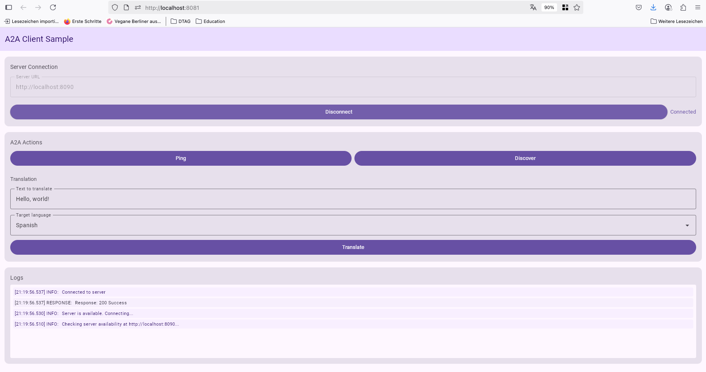
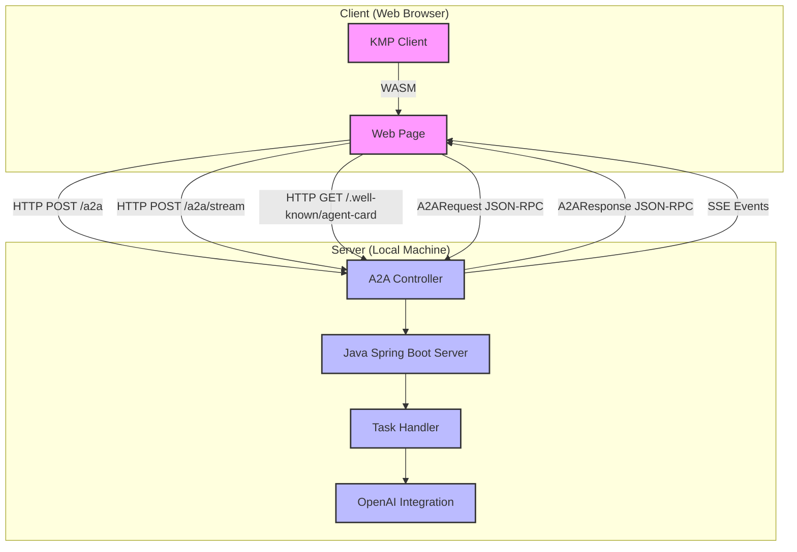

# ka2a
PoC of KMP  based A2A client

https://google-a2a.github.io/A2A/latest/specification/



## Running the A2A Server

The A2A (Agent-to-Agent) server is bases of google's official A2A sample and is implemented in Java with Spring Boot and provides a translation service. See details to official sample https://a2aprotocol.ai/docs/guide/a2a-java-sample

Here's how to run it:

### Running Locally

1. Set the required environment variables:
   ```bash
   export OPENAI_BASE_URL=https://api.openai.com/v1
   export OPENAI_API_KEY=your-api-key
   export OPENAI_CHAT_MODEL=gpt-3.5-turbo
   ```

2. Navigate to the server-java directory:
   ```bash
   cd server-java
   ```

3. Build and run the application:
   ```bash
   ./gradlew bootRun
   ```

The server will start on port 8090. You can access the agent card at http://localhost:8090/.well-known/agent-card

### Running with Docker

1. Navigate to the server-java directory:
   ```bash
   cd server-java
   ```

2. Build the Docker image:
   ```bash
   docker build -t a2a-server .
   ```

3. Run the Docker container:
   ```bash
   docker run -p 8090:8090 \
     -e OPENAI_BASE_URL=https://api.openai.com/v1 \
     -e OPENAI_API_KEY=your-api-key \
     -e OPENAI_CHAT_MODEL=gpt-3.5-turbo \
     a2a-server
   ```

The server will be accessible at http://localhost:8090.

## Running the A2A Client Sample

A sample WASM web application is provided to demonstrate how to use the A2A client library to communicate with the A2A server. The sample is implemented using Compose Multiplatform with Material 3 design.

1. Start the A2A server as described above.

2. In a separate terminal, run the sample application:
   ```bash
   ./gradlew :samples:wasmJsBrowserDevelopmentRun
   ```

3. Open your browser at http://localhost:8080/ (the browser should open automatically)

See the [samples README](samples/README.md) for more details.

## Architecture Diagram



The diagram above illustrates the architecture and data flow of the ka2a system:

1. **Client Side**:
   - The KMP (Kotlin Multiplatform) client is compiled to WebAssembly (WASM) and runs in a web browser
   - The client communicates with the server using HTTP requests

2. **Server Side**:
   - A Java Spring Boot server running locally on port 8090
   - The A2A Controller handles incoming requests
   - The Task Handler processes A2A tasks
   - Integration with OpenAI for translation services

3. **Communication**:
   - JSON-RPC 2.0 protocol over HTTP
   - Three main endpoints:
     - `/a2a` - For standard JSON-RPC requests (tasks/send, tasks/get, tasks/cancel)
     - `/a2a/stream` - For streaming responses using Server-Sent Events (SSE)
     - `/.well-known/agent-card` - For retrieving agent capabilities

4. **Data Flow**:
   - Client sends A2ARequest objects to the server
   - Server processes requests and returns A2AResponse objects
   - For streaming tasks, server sends SSE events with task updates
